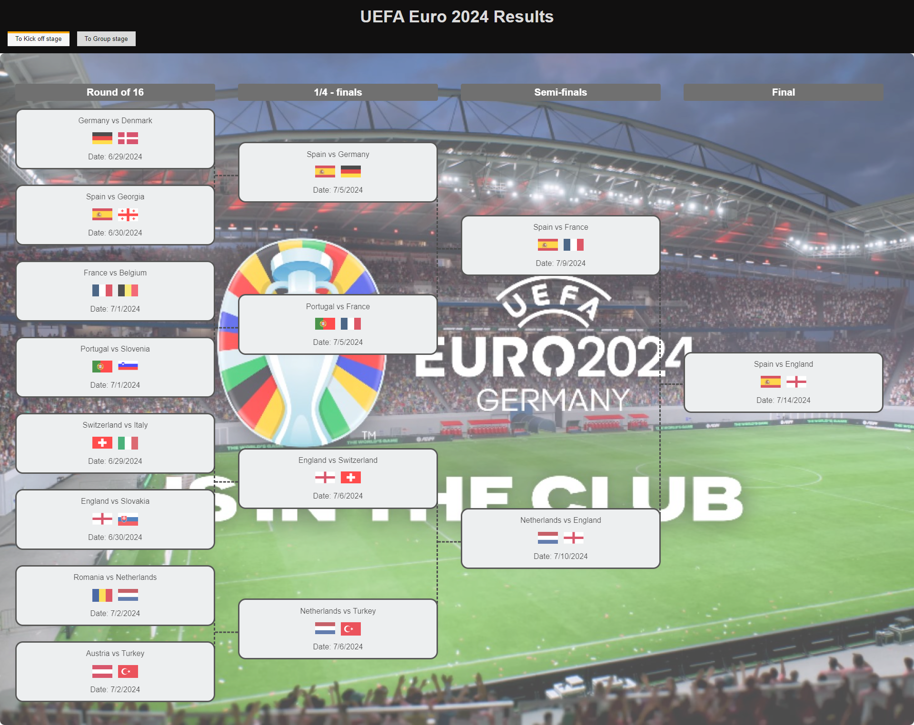
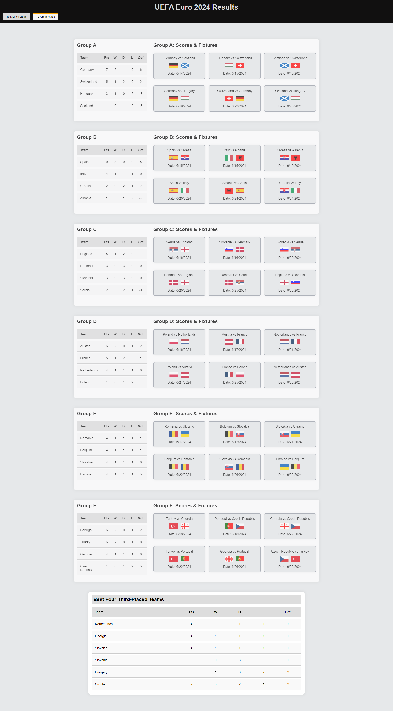
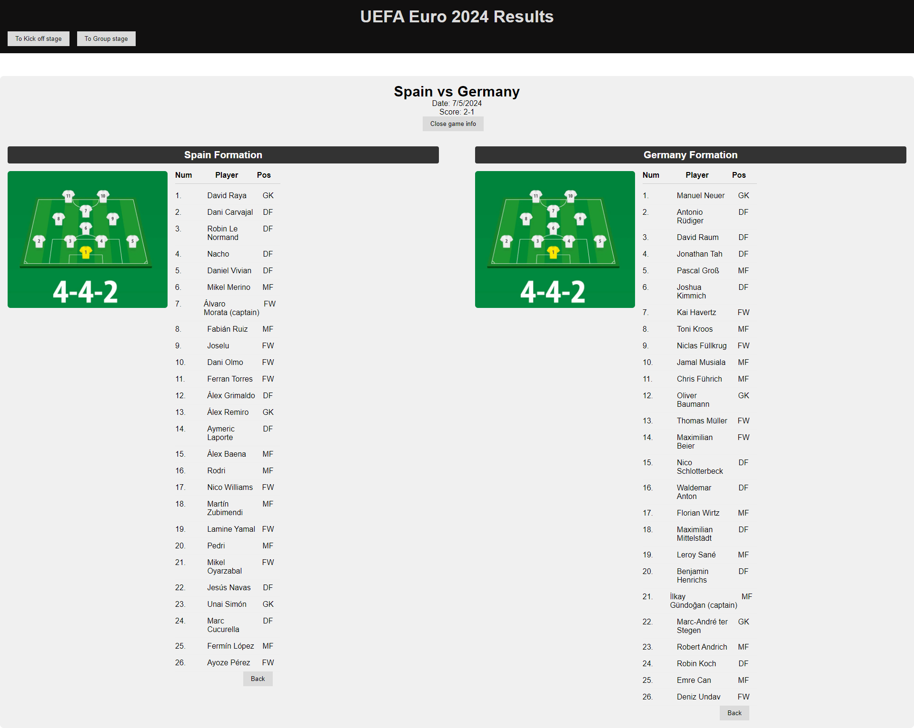
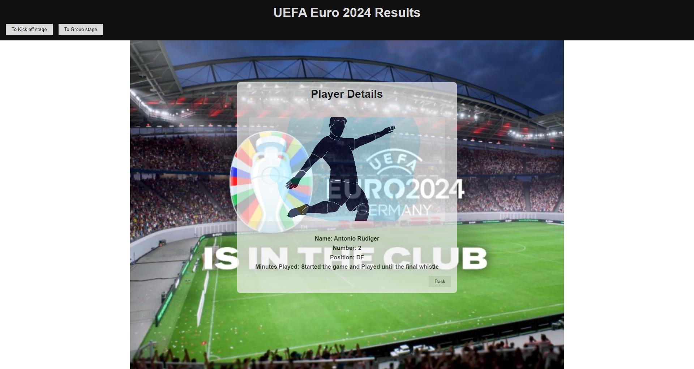

# React + Vite
# Sirma academy final task

Euro2024 is a project where a valid data from CSV files (4 files) has to be parsed (no additional libraries are allowed) and displayed to users, showing the championship games from the beginning to the final. Additional information about the games, teams, and players who participated in the championship (and their corresponding games) must be displayed where appropriate, to achieve a good user experience (UX)

# Main Page
#The Elimination rounds representing the road to the final game

# Group page
 #Representing the group standing after the group games completition and displays all group games

## Features

- **View Game Details**: Click on any game and aditional info will be displayed
- **View Team Detaisl**: Click on any team and aditional info will be displayed

- **View Player Detaisl**: Click on any team plaeyer and aditional info will be displayed for the player in this specific game.

- **Responsive Design**: The application is responsive and should works well on both desktop and mobile devices

## Installation

1. **Install Dependencies:
npm install

1. ** Running the Project
npm run dev

